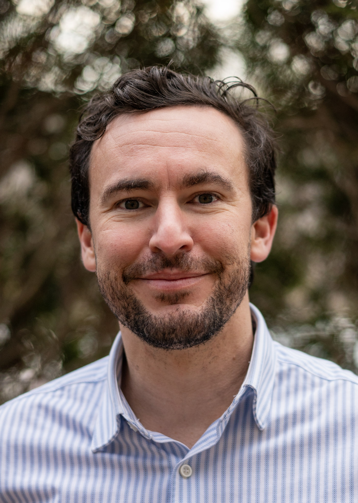

:::: {.columns}

::: {.column width="30%"}
{width=100% style="border-radius: 4px;"}
:::

::: {.column width="5%"}
:::

::: {.column width="65%"}
I am an Assistant Professor in Political Science and International Relations at [Tecnológico de Monterrey](https://tec.mx) in Mexico. I received my Ph.D. from the University of Colorado Boulder.

My research examines public opinion on democratic backsliding, asking why people support or resist elected leaders who undermine democracy. My recent articles examine how backsliding leaders manipulate public opinion to garner support for their efforts to erode democracy, and what strategies pro-democracy actors can use to rebut their misleading rhetoric.  Additional projects examine public opinion about migration and direct democracy in comparative perspective. My work combines survey experiments, text analysis, and multilevel statistical modeling.

My research has been published in the *Proceedings of the National Academy of Sciences*, *Comparative Political Studies*, *Political Behavior*, *Electoral Studies*, and *Research & Politics*, among other journals.

[brettbessen@tec.mx](mailto:brettbessen@tec.mx) | [Google Scholar](https://scholar.google.com.mx/citations?user=JWYqgN0AAAAJ&hl=es&oi=ao) | [Twitter/X](https://twitter.com/BessenBrett) | [LinkedIn](https://www.linkedin.com/in/brett-bessen/)
:::

::::
