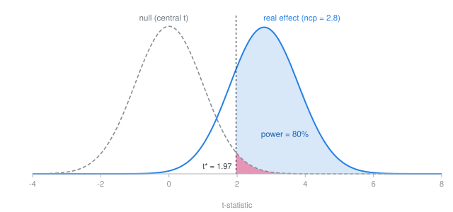
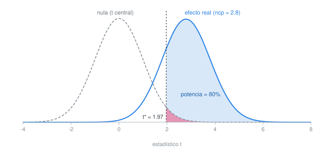

```{=html}
<div class="lang-toggle">
  <button type="button" class="lang-btn" data-lang="en" id="lang-btn-en">English</button>
  <button type="button" class="lang-btn" data-lang="es" id="lang-btn-es">Español</button>
</div>
<style>
.lang-toggle { display: flex; gap: 0.4rem; margin: 0 0 1.4rem; }
.lang-btn {
  font-size: 0.78rem;
  padding: 3px 11px;
  border-radius: 5px;
  border: 1px solid #6c757d;
  background: transparent;
  color: #6c757d;
  cursor: pointer;
  font-weight: 600;
  letter-spacing: 0.01em;
}
.lang-btn:hover { background: #f1f3f5; }
.lang-btn.active {
  background: #2780e3;
  border-color: #2780e3;
  color: #fff;
}
body:not(.show-es) .lang-es { display: none; }
body.show-es .lang-en { display: none; }
</style>
<script>
(function () {
  "use strict";
  function apply(lang) {
    document.body.classList.toggle("show-es", lang === "es");
    document.querySelectorAll(".lang-btn").forEach(function (b) {
      b.classList.toggle("active", b.getAttribute("data-lang") === lang);
    });
    if (window.powerToolSetLang) window.powerToolSetLang(lang);
    try { localStorage.setItem("bb-lang", lang); } catch (e) {}
    if (window.MathJax && window.MathJax.typesetPromise) {
      window.MathJax.typesetPromise();
    }
  }
  var stored = null;
  try { stored = localStorage.getItem("bb-lang"); } catch (e) {}
  var initial = stored === "es" ? "es" : "en";
  document.getElementById("lang-btn-en").addEventListener("click", function () { apply("en"); });
  document.getElementById("lang-btn-es").addEventListener("click", function () { apply("es"); });
  apply(initial);
  window.bbApplyLang = apply;
})();
</script>
```

::: {.lang-en}


How many respondents do I need for my study? One way to think about this is in terms of **statistical power**. If there is an effect of your treatment, you want to be able to detect it and distinguish it from zero.

Statistical power is the probability that your study detects an effect that is really there, the true positive rate. Statistical power depends on three things:

- **the size of the effect** you are trying to detect,
- **the amount of noise** in your outcome, and
- **the size of your sample** (number of respondents).

One way to increase power is to increase the sample size. But note that these three things combine into one quantity. If your treatment moves the outcome by $\delta$ and the outcome has standard deviation $\sigma$, the *standardized effect* is $d = \delta / \sigma$, and power is driven by

$$
\text{ncp} = d \sqrt{n/2} = \frac{\delta}{\sigma}\sqrt{n/2}.
$$

<details><summary>What is that "ncp"?</summary><p>Read it as the true effect expressed in standard errors: roughly the <em>t</em>-statistic you should expect to get. Under the null, your <em>t</em>-statistic follows the usual central <em>t</em> distribution, centered on zero. When there is a real effect it follows a <em>noncentral</em> <em>t</em> — same family, shifted away from zero — and the <strong>noncentrality parameter</strong> is how far it shifts. Power is the area of that shifted distribution past your critical value, so a noncentrality near 2.8 gives 80% power at &alpha; = 0.05.</p>
<figure class="ncp-fig">

<figcaption>Both curves are <em>t</em> distributions with 298 degrees of freedom, the sample size the calculator opens with (<em>n</em> = 150 per group). A real effect slides the distribution to the right by the noncentrality parameter; the 2.8 drawn here is the 80%-power benchmark, not the effect size the calculator opens with. Power (blue) is the share of the shifted curve past the critical value <em>t</em>* = 1.97; the red sliver is the &alpha;/2 = 2.5% the null curve leaves in the same region, the false positives.</figcaption>
</figure>
</details>

You have **three levers** to increase power:

1. **Make the effect bigger** — design a stronger, clearer treatment.
2. **Make the noise smaller** — block, add covariates, use a better-measured outcome.
3. **Collect more data** — raise $n$.

$\delta$ and $\sigma$ enter as a *ratio*: halving the noise buys exactly what doubling the effect buys. And $n$ enters under a **square root** — quadrupling your sample only doubles the signal. This is why "collect more data" is usually the most expensive lever, and why hard thinking about your treatment and your measurement is usually the cheapest.

## What units is the effect size in?

$\delta$ and $\sigma$ take whatever units your outcome uses — scale points, pesos, vote share — as long as the two agree. Their ratio has none: $d = \delta/\sigma$ is measured in standard deviations, so $d = 0.2$ means the treatment moves the outcome one-fifth of a standard deviation.

That ratio is **Cohen's $d$**. You can use Cohen's $d$ to approximate your effect size by comparing your design to existing research. Cohen's benchmarks are: $0.2$ small effect, $0.5$ medium effect, $0.8$ large effect. But use these with caution. Effects in political behavior can fall well under $0.2$. Designing around $0.5$ can lead to an underpowered study. Anchor your guess in studies closest to your own design instead, then shade down.

Use the calculator to see how the three levers trade off against each other.

:::

::: {.lang-es}

¿Cuántos encuestados necesito para mi estudio? Una forma de pensarlo es en términos de la **potencia estadística**. Si tu tratamiento tiene un efecto, quieres poder detectarlo y distinguirlo de cero.

La potencia estadística es la probabilidad de que tu estudio detecte un efecto que realmente existe, la tasa de verdaderos positivos. La potencia estadística depende de tres cosas:

- **el tamaño del efecto** que buscas detectar,
- **la cantidad de ruido** en tu variable de resultado, y
- **el tamaño de tu muestra** (número de encuestados).

Una forma de aumentar la potencia es aumentar el tamaño de la muestra. Pero nota que estas tres cosas se combinan en una sola cantidad. Si tu tratamiento mueve el resultado en $\delta$ y el resultado tiene desviación estándar $\sigma$, el *efecto estandarizado* es $d = \delta / \sigma$, y la potencia depende de

$$
\text{ncp} = d \sqrt{n/2} = \frac{\delta}{\sigma}\sqrt{n/2}.
$$

<details><summary>¿Qué es eso de "ncp"?</summary><p>Interprétalo como el efecto verdadero expresado en errores estándar: aproximadamente el estadístico <em>t</em> que deberías esperar obtener. Bajo la hipótesis nula, tu estadístico <em>t</em> sigue la distribución <em>t</em> central habitual, centrada en cero. Cuando existe un efecto real, sigue una <em>t</em> <em>no central</em> —de la misma familia, pero desplazada del cero— y el <strong>parámetro de no centralidad</strong> indica qué tan lejos se desplaza. La potencia es el área de esa distribución desplazada más allá de tu valor crítico, así que un parámetro de no centralidad cercano a 2.8 da 80% de potencia con &alpha; = 0.05.</p>
<figure class="ncp-fig">

<figcaption>Ambas curvas son distribuciones <em>t</em> con 298 grados de libertad, el tamaño de muestra con el que abre la calculadora (<em>n</em> = 150 por grupo). Un efecto real desplaza la distribución hacia la derecha por el parámetro de no centralidad; el 2.8 que se dibuja aquí es el punto de referencia del 80% de potencia, no el tamaño del efecto con el que abre la calculadora. La potencia (azul) es la parte de esa curva desplazada más allá del valor crítico <em>t</em>* = 1.97; la franja roja es el &alpha;/2 = 2.5% que la curva nula deja en esa misma región, los falsos positivos.</figcaption>
</figure>
</details>

Tienes **tres palancas** para aumentar la potencia:

1. **Agrandar el efecto** — diseña un tratamiento más fuerte y más claro.
2. **Reducir el ruido** — usa bloques, añade covariables, mide mejor tu resultado.
3. **Recolectar más datos** — aumenta $n$.

$\delta$ y $\sigma$ entran como una *razón*: reducir el ruido a la mitad logra exactamente lo mismo que duplicar el efecto. Y $n$ entra bajo una **raíz cuadrada** — cuadruplicar tu muestra solo duplica la señal. Por eso "recolectar más datos" suele ser la palanca más cara, y pensar bien tu tratamiento y tu medición suele ser la más barata.

## ¿En qué unidades está el tamaño del efecto?

$\delta$ y $\sigma$ toman las unidades que use tu resultado —puntos de escala, pesos, porcentaje de votos— siempre que ambas coincidan. Su razón no tiene unidades: $d = \delta/\sigma$ se mide en desviaciones estándar, así que $d = 0.2$ significa que el tratamiento mueve el resultado un quinto de una desviación estándar.

Esa razón es la **$d$ de Cohen**. Puedes usar la $d$ de Cohen para aproximar el tamaño de tu efecto comparando tu diseño con investigaciones ya publicadas. Los puntos de referencia de Cohen son: $0.2$ efecto pequeño, $0.5$ efecto mediano, $0.8$ efecto grande. Pero úsalos con cautela. Los efectos en comportamiento político pueden quedar muy por debajo de $0.2$. Diseñar pensando en $0.5$ puede llevar a un estudio subpotenciado. Ancla tu estimación en los estudios más cercanos a tu propio diseño y luego ajústala a la baja.

Usa la calculadora para ver cómo se compensan entre sí las tres palancas.

:::

```{=html}
<div id="power-tool">

  <div class="pt-grid">
    <div class="pt-controls">

      <div class="pt-lever" data-lever="effect">
        <div class="pt-lever-head"><span class="pt-num">1</span> <span data-i18n="lvl-effect">Effect size</span></div>
        <label><span data-i18n="lbl-delta">Expected treatment effect &delta;</span> <em data-i18n="unit-outcome">(outcome units)</em>
          <span class="pt-val" id="out-delta">0.30</span></label>
        <input type="range" id="in-delta" min="0" max="2" step="0.01" value="0.3">
        <label><span data-i18n="lbl-sigma">Outcome standard deviation &sigma;</span> <em data-i18n="unit-outcome2">(outcome units)</em>
          <span class="pt-val" id="out-sigma">1.50</span></label>
        <input type="range" id="in-sigma" min="0.1" max="5" step="0.05" value="1.5">
      </div>

      <div class="pt-lever" data-lever="noise">
        <div class="pt-lever-head"><span class="pt-num">2</span> <span data-i18n="lvl-noise">Noise reduction</span></div>
        <label><span data-i18n="lbl-r2">Outcome variance explained by blocking / covariates (R&sup2;)</span>
          <span class="pt-val" id="out-r2">0%</span></label>
        <input type="range" id="in-r2" min="0" max="0.9" step="0.01" value="0">
        <div class="pt-hint"><span data-i18n="lbl-residual">Residual SD after adjustment:</span>
          <strong id="out-sigmar">1.50</strong></div>
      </div>

      <div class="pt-lever" data-lever="n">
        <div class="pt-lever-head"><span class="pt-num">3</span> <span data-i18n="lvl-n">Sample size</span></div>
        <label><span data-i18n="lbl-participants">Participants</span> <em data-i18n="unit-pergroup">per group</em>
          <span class="pt-val" id="out-n">150</span></label>
        <input type="range" id="in-n" min="5" max="1000" step="5" value="150">
        <div class="pt-hint"><span data-i18n="lbl-total">Total sample:</span> <strong id="out-ntot">300</strong></div>
      </div>

      <div class="pt-lever pt-lever-muted">
        <div class="pt-lever-head"><span data-i18n="lvl-testsettings">Test settings</span></div>
        <label><span data-i18n="lbl-alpha">Significance level &alpha;</span>
          <span class="pt-val" id="out-alpha">0.05</span></label>
        <input type="range" id="in-alpha" min="0.01" max="0.10" step="0.01" value="0.05">
        <label><span data-i18n="lbl-target">Target power</span>
          <span class="pt-val" id="out-target">80%</span></label>
        <input type="range" id="in-target" min="0.5" max="0.99" step="0.01" value="0.8">
      </div>

    </div>

    <div class="pt-readout">
      <div class="pt-power-label" data-i18n="lbl-power">Power</div>
      <div class="pt-power-num" id="out-power">40.8%</div>
      <div class="pt-meter"><div class="pt-meter-fill" id="out-meter"></div>
        <div class="pt-meter-target" id="out-meter-target"></div></div>
      <div class="pt-verdict" id="out-verdict"></div>

      <div class="pt-derived">
        <div><span data-i18n="lbl-cohend">Cohen's <em>d</em> (SD units)</span><strong id="out-d">0.20</strong></div>
        <div><span data-i18n="lbl-ncp">Noncentrality <em>d</em>&radic;(<em>n</em>/2)</span><strong id="out-ncp">1.73</strong></div>
        <div><span data-i18n="lbl-beta">Type II error rate &beta;</span><strong id="out-beta">59.2%</strong></div>
      </div>
    </div>
  </div>

  <div class="pt-reset"><button id="pt-reset-btn" data-i18n="btn-reset">Reset to defaults</button></div>
</div>

<style>
#power-tool {
  --pt-blue: #2780e3;
  --pt-green: #3fb618;
  --pt-amber: #ff7518;
  --pt-red: #ff0039;
  --pt-line: #dee2e6;
  --pt-muted: #6c757d;
  margin: 1.5em 0;
  font-size: 0.94rem;
}
#power-tool .pt-grid {
  display: grid;
  grid-template-columns: 1fr 260px;
  gap: 1.25rem;
  align-items: start;
}
#power-tool .pt-controls {
  display: grid;
  grid-template-columns: repeat(2, minmax(0, 1fr));
  gap: 0.75rem;
}
#power-tool .pt-lever {
  border: 1px solid var(--pt-line);
  border-radius: 6px;
  padding: 0.7rem 0.85rem 0.9rem;
}
#power-tool .pt-lever-head {
  font-weight: 600;
  margin-bottom: 0.5rem;
  display: flex;
  align-items: center;
  gap: 0.45rem;
}
#power-tool .pt-num {
  display: inline-flex;
  align-items: center;
  justify-content: center;
  width: 1.35em;
  height: 1.35em;
  border-radius: 50%;
  background: var(--pt-blue);
  color: #fff;
  font-size: 0.78em;
  font-weight: 700;
  flex: none;
}
#power-tool .pt-lever-muted .pt-lever-head { color: var(--pt-muted); }
#power-tool .pt-lever-muted { background: #f8f9fa; }
#power-tool label {
  display: flex;
  justify-content: space-between;
  align-items: baseline;
  gap: 0.5rem;
  font-size: 0.86em;
  color: #495057;
  margin-top: 0.5rem;
}
#power-tool .pt-val {
  font-variant-numeric: tabular-nums;
  font-weight: 600;
  color: #212529;
  white-space: nowrap;
}
#power-tool input[type=range] {
  width: 100%;
  margin: 0.25rem 0 0;
  accent-color: var(--pt-blue);
}
#power-tool .pt-hint {
  font-size: 0.8em;
  color: var(--pt-muted);
  margin-top: 0.5rem;
}
#power-tool .pt-hint-block { margin: 0 0 0.75rem; }

#power-tool .pt-readout {
  border: 1px solid var(--pt-line);
  border-radius: 6px;
  padding: 1rem;
  text-align: center;
  position: sticky;
  top: 1rem;
}
#power-tool .pt-power-label {
  text-transform: uppercase;
  letter-spacing: 0.06em;
  font-size: 0.72em;
  color: var(--pt-muted);
}
#power-tool .pt-power-num {
  font-size: 2.9rem;
  font-weight: 700;
  line-height: 1.1;
  font-variant-numeric: tabular-nums;
}
#power-tool .pt-meter {
  position: relative;
  height: 9px;
  background: #e9ecef;
  border-radius: 5px;
  overflow: hidden;
  margin: 0.5rem 0 0.15rem;
}
#power-tool .pt-meter-fill {
  height: 100%;
  width: 40.8%;
  background: var(--pt-amber);
  transition: width 0.12s linear;
}
#power-tool .pt-meter-target {
  position: absolute;
  top: -2px;
  bottom: -2px;
  width: 2px;
  background: #343a40;
  left: 80%;
}
#power-tool .pt-verdict {
  font-size: 0.82em;
  min-height: 2.6em;
  margin-top: 0.5rem;
  color: #495057;
}
#power-tool .pt-derived {
  border-top: 1px solid var(--pt-line);
  margin-top: 0.6rem;
  padding-top: 0.6rem;
  font-size: 0.82em;
}
#power-tool .pt-derived div {
  display: flex;
  justify-content: space-between;
  gap: 0.5rem;
  padding: 0.15rem 0;
  text-align: left;
}
#power-tool .pt-derived span { color: var(--pt-muted); }
#power-tool .pt-derived strong { font-variant-numeric: tabular-nums; }

#power-tool .pt-reset { margin-top: 1rem; }
#power-tool .pt-reset button {
  font-size: 0.82em;
  padding: 2px 9px;
  border-radius: 5px;
  border: 1px solid var(--pt-muted);
  background: transparent;
  color: var(--pt-muted);
  cursor: pointer;
}
#power-tool .pt-reset button:hover { background: #f1f3f5; }

@media (max-width: 820px) {
  #power-tool .pt-grid { grid-template-columns: 1fr; }
  #power-tool .pt-readout { position: static; }
  #power-tool .pt-controls { grid-template-columns: 1fr; }
}
</style>

<script>
(function () {
  "use strict";

  // =========================================================================
  // Distribution functions. Everything below reproduces R's power.t.test()
  // to within 8e-9 across n in [5, 400], d in [0.1, 1.2], alpha in {.01,.05}.
  // =========================================================================

  // Log-gamma (Lanczos, g = 7)
  function lgamma(x) {
    var g = 7,
      c = [0.99999999999980993, 676.5203681218851, -1259.1392167224028,
           771.32342877765313, -176.61502916214059, 12.507343278686905,
           -0.13857109526572012, 9.9843695780195716e-6, 1.5056327351493116e-7];
    if (x < 0.5) return Math.log(Math.PI / Math.sin(Math.PI * x)) - lgamma(1 - x);
    x -= 1;
    var a = c[0], t = x + g + 0.5;
    for (var i = 1; i < g + 2; i++) a += c[i] / (x + i);
    return 0.5 * Math.log(2 * Math.PI) + (x + 0.5) * Math.log(t) - t + Math.log(a);
  }

  // Standard normal CDF (Hart's algorithm)
  function pnorm(x) {
    var xa = Math.abs(x), cum;
    if (xa > 37) {
      cum = 0;
    } else {
      var e = Math.exp(-xa * xa / 2);
      if (xa < 7.07106781186547) {
        var b = 3.52624965998911e-02 * xa + 0.700383064443688;
        b = b * xa + 6.37396220353165;
        b = b * xa + 33.912866078383;
        b = b * xa + 112.079291497871;
        b = b * xa + 221.213596169931;
        b = b * xa + 220.206867912376;
        var d = 8.83883476483184e-02 * xa + 1.75566716318264;
        d = d * xa + 16.064177579207;
        d = d * xa + 86.7807322029461;
        d = d * xa + 296.564248779674;
        d = d * xa + 637.333633378831;
        d = d * xa + 793.826512519948;
        d = d * xa + 440.413735824752;
        cum = e * b / d;
      } else {
        var f = xa + 0.65;
        f = xa + 4 / f; f = xa + 3 / f; f = xa + 2 / f; f = xa + 1 / f;
        cum = e / f / 2.506628274631;
      }
    }
    return x > 0 ? 1 - cum : cum;
  }

  // Incomplete beta, continued-fraction form
  function betacf(a, b, x) {
    var FPMIN = 1e-300, EPS = 3e-16,
      qab = a + b, qap = a + 1, qam = a - 1,
      c = 1, d = 1 - qab * x / qap;
    if (Math.abs(d) < FPMIN) d = FPMIN;
    d = 1 / d;
    var h = d;
    for (var m = 1; m <= 300; m++) {
      var m2 = 2 * m,
        aa = m * (b - m) * x / ((qam + m2) * (a + m2));
      d = 1 + aa * d; if (Math.abs(d) < FPMIN) d = FPMIN;
      c = 1 + aa / c; if (Math.abs(c) < FPMIN) c = FPMIN;
      d = 1 / d; h *= d * c;
      aa = -(a + m) * (qab + m) * x / ((a + m2) * (qap + m2));
      d = 1 + aa * d; if (Math.abs(d) < FPMIN) d = FPMIN;
      c = 1 + aa / c; if (Math.abs(c) < FPMIN) c = FPMIN;
      d = 1 / d;
      var del = d * c; h *= del;
      if (Math.abs(del - 1) < EPS) break;
    }
    return h;
  }

  function betai(a, b, x) {
    if (x <= 0) return 0;
    if (x >= 1) return 1;
    var bt = Math.exp(lgamma(a + b) - lgamma(a) - lgamma(b) +
                      a * Math.log(x) + b * Math.log(1 - x));
    return x < (a + 1) / (a + b + 2)
      ? bt * betacf(a, b, x) / a
      : 1 - bt * betacf(b, a, 1 - x) / b;
  }

  // Central t CDF and quantile (quantile by bisection; the CDF is monotone)
  function pt(t, df) {
    var p = 0.5 * betai(df / 2, 0.5, df / (df + t * t));
    return t > 0 ? 1 - p : p;
  }

  var qtCache = {};
  function qt(p, df) {
    var key = p + "|" + df;
    if (qtCache[key] !== undefined) return qtCache[key];
    var lo = 0, hi = 1;
    while (pt(hi, df) < p && hi < 1e6) hi *= 2;
    for (var i = 0; i < 200; i++) {
      var mid = (lo + hi) / 2;
      if (pt(mid, df) < p) lo = mid; else hi = mid;
      if (hi - lo < 1e-12) break;
    }
    var out = (lo + hi) / 2;
    qtCache[key] = out;
    return out;
  }

  // Noncentral t CDF. T = (Z + ncp)/sqrt(V/df), so
  // P(T <= t | V = v) = Phi(t*sqrt(v/df) - ncp); integrate against chi-sq(df).
  function pnct(t, df, ncp) {
    var sd = Math.sqrt(2 * df),
      lo = Math.max(0, df - 12 * sd),
      hi = df + 12 * sd + 40,
      N = 1200,
      h = (hi - lo) / N,
      logNorm = (df / 2) * Math.LN2 + lgamma(df / 2);
    function f(v) {
      if (v <= 0) return 0;
      var logpdf = (df / 2 - 1) * Math.log(v) - v / 2 - logNorm;
      return Math.exp(logpdf) * pnorm(t * Math.sqrt(v / df) - ncp);
    }
    var s = f(lo) + f(hi);
    for (var i = 1; i < N; i++) s += f(lo + i * h) * (i % 2 ? 4 : 2);
    return s * h / 3;
  }

  // Power for a two-group difference in means, two-sided test.
  // Upper tail only: rejecting in the wrong direction is not power.
  function power(n, d, alpha) {
    if (!(n >= 2) || !isFinite(d)) return NaN;
    var df = 2 * n - 2,
      ncp = d * Math.sqrt(n / 2),
      tc = qt(1 - alpha / 2, df);
    return 1 - pnct(tc, df, ncp);
  }

  // =========================================================================
  // Wiring
  // =========================================================================

  var DEFAULTS = { delta: 0.3, sigma: 1.5, r2: 0, n: 150, alpha: 0.05, target: 0.8 };
  var ids = ["delta", "sigma", "r2", "n", "alpha", "target"];
  var inputs = {};
  ids.forEach(function (k) { inputs[k] = document.getElementById("in-" + k); });

  function $(id) { return document.getElementById(id); }
  function pct(x) { return (x * 100).toFixed(0) + "%"; }
  function pct1(x) { return (x * 100).toFixed(1) + "%"; }

  // ---- Localization -------------------------------------------------------
  var LANG = "en";

  var STRINGS = {
    "lvl-effect": { en: "Effect size", es: "Tamaño del efecto" },
    "lbl-delta": { en: "Expected treatment effect &delta;", es: "Efecto esperado del tratamiento &delta;" },
    "unit-outcome": { en: "(outcome units)", es: "(unidades del resultado)" },
    "lbl-sigma": { en: "Outcome standard deviation &sigma;", es: "Desviación estándar del resultado &sigma;" },
    "unit-outcome2": { en: "(outcome units)", es: "(unidades del resultado)" },
    "lvl-noise": { en: "Noise reduction", es: "Reducción de ruido" },
    "lbl-r2": { en: "Outcome variance explained by blocking / covariates (R&sup2;)", es: "Varianza del resultado explicada por bloques o covariables (R&sup2;)" },
    "lbl-residual": { en: "Residual SD after adjustment:", es: "DE residual después del ajuste:" },
    "lvl-n": { en: "Sample size", es: "Tamaño de muestra" },
    "lbl-participants": { en: "Participants", es: "Participantes" },
    "unit-pergroup": { en: "per group", es: "por grupo" },
    "lbl-total": { en: "Total sample:", es: "Muestra total:" },
    "lvl-testsettings": { en: "Test settings", es: "Parámetros de la prueba" },
    "lbl-alpha": { en: "Significance level &alpha;", es: "Nivel de significancia &alpha;" },
    "lbl-target": { en: "Target power", es: "Potencia objetivo" },
    "lbl-power": { en: "Power", es: "Potencia" },
    "lbl-cohend": { en: "Cohen's <em>d</em> (SD units)", es: "<em>d</em> de Cohen (unidades de DE)" },
    "lbl-ncp": { en: "Noncentrality <em>d</em>&radic;(<em>n</em>/2)", es: "No centralidad <em>d</em>&radic;(<em>n</em>/2)" },
    "lbl-beta": { en: "Type II error rate &beta;", es: "Tasa de error tipo II &beta;" },
    "btn-reset": { en: "Reset to defaults", es: "Restablecer valores predeterminados" }
  };

  function applyStaticStrings() {
    Object.keys(STRINGS).forEach(function (key) {
      var el = document.querySelector('[data-i18n="' + key + '"]');
      if (el) el.innerHTML = STRINGS[key][LANG];
    });
  }

  function setLang(lang) {
    LANG = lang === "es" ? "es" : "en";
    applyStaticStrings();
    update();
  }
  window.powerToolSetLang = setLang;

  function update() {
    var delta = +inputs.delta.value,
      sigma = +inputs.sigma.value,
      r2 = +inputs.r2.value,
      n = +inputs.n.value,
      alpha = +inputs.alpha.value,
      target = +inputs.target.value;

    // Blocking and covariate adjustment shrink the residual SD, which is
    // mathematically identical to enlarging the standardized effect.
    var sigmaR = sigma * Math.sqrt(1 - r2),
      d = delta / sigmaR,
      ncp = d * Math.sqrt(n / 2),
      pw = power(n, d, alpha);

    $("out-delta").textContent = delta.toFixed(2);
    $("out-sigma").textContent = sigma.toFixed(2);
    $("out-r2").textContent = pct(r2);
    $("out-sigmar").textContent = sigmaR.toFixed(2);
    $("out-n").textContent = n;
    $("out-ntot").textContent = 2 * n;
    $("out-alpha").textContent = alpha.toFixed(2);
    $("out-target").textContent = pct(target);

    $("out-power").textContent = pct1(pw);
    $("out-d").textContent = d.toFixed(2);
    $("out-ncp").textContent = ncp.toFixed(2);
    $("out-beta").textContent = pct1(1 - pw);

    var col = pw >= target ? "var(--pt-green)"
      : pw >= 0.5 ? "var(--pt-amber)" : "var(--pt-red)";
    $("out-power").style.color = col;
    $("out-meter").style.width = (pw * 100).toFixed(1) + "%";
    $("out-meter").style.background = col;
    $("out-meter-target").style.left = (target * 100).toFixed(1) + "%";

    $("out-verdict").textContent = pw >= target
      ? (LANG === "es" ? "Este diseño alcanza tu objetivo."
                        : "This design reaches your target.")
      : (LANG === "es"
          ? "Subpotenciado. Si el efecto es real, lo pasarías por alto el "
            + pct1(1 - pw) + " de las veces."
          : "Underpowered. If the effect is real, you would miss it "
            + pct1(1 - pw) + " of the time.");

  }

  ids.forEach(function (k) {
    inputs[k].addEventListener("input", update);
    // Don't let a page scroll over a slider silently change the design.
    inputs[k].addEventListener("wheel", function (e) { e.preventDefault(); },
                               { passive: false });
  });
  $("pt-reset-btn").addEventListener("click", function () {
    ids.forEach(function (k) { inputs[k].value = DEFAULTS[k]; });
    update();
  });

  var storedLang = null;
  try { storedLang = localStorage.getItem("bb-lang"); } catch (e) {}
  setLang(storedLang === "es" ? "es" : "en");
})();
</script>
```

::: {.lang-en}

## What the calculator assumes

The design is the simplest useful one: **two groups, equal sizes, comparing means, two-sided test**. Power comes from the exact noncentral $t$ distribution rather than a large-sample normal approximation, so the numbers match R's `power.t.test()`.

Three things worth knowing about how the levers are modelled:

**Effect size is the effect you want to detect, not the effect you hope to find.** Enter the smallest difference that would still matter substantively. Powering a study on an optimistic guess is the most common way to end up underpowered — and the effect you can *just* detect is, by construction, one you can only estimate imprecisely.

**Noise reduction is expressed as $R^2$**, the share of outcome variance explained by your blocking variables or covariates. Pre-treatment measures of the outcome itself are usually the most powerful covariates available — the statistical argument for a pre-test.

**Power is the upper-tail probability only.** Rejecting the null in the *wrong* direction is not a success, so it does not count here. This is also R's convention, and it is why power approaches $\alpha/2$, not $\alpha$, as the effect goes to zero.

The calculator does not subtract degrees of freedom for covariates. With $k$ covariates the residual df is $2n - 2 - k$; the effect on power is negligible unless $k$ is large relative to $n$, but it is not exactly zero.

## Checking it against R

Every number here can be reproduced in R. For the default design — $\delta = 0.3$, $\sigma = 1.5$, $n = 150$ per group:

```r
power.t.test(n = 150, delta = 0.3, sd = 1.5,
             sig.level = 0.05, type = "two.sample")

# With covariates explaining 30% of outcome variance,
# the residual SD shrinks by sqrt(1 - 0.30):
power.t.test(n = 150, delta = 0.3, sd = 1.5 * sqrt(1 - 0.30),
             sig.level = 0.05, type = "two.sample")
```

For designs beyond two-group comparisons of means, use the [`pwr`](https://cran.r-project.org/package=pwr) package, or simulate: generate data under an assumed effect, run your actual analysis, repeat a few thousand times, count how often you reject. Simulation is slower, but it handles the clustering, interactions, and non-normal outcomes that no closed-form calculator covers.

:::

::: {.lang-es}

## Qué supone la calculadora

El diseño es el más simple y útil: **dos grupos, tamaños iguales, comparación de medias, prueba de dos colas**. La potencia se calcula con la distribución $t$ no central exacta, no con una aproximación normal de muestra grande, así que los números coinciden con `power.t.test()` de R.

Tres cosas que vale la pena saber sobre cómo se modelan las palancas:

**El tamaño del efecto es el que quieres detectar, no el que esperas encontrar.** Ingresa la diferencia más pequeña que aún importaría sustantivamente. Calcular la potencia con una estimación optimista es la manera más común de terminar subpotenciado —y el efecto que apenas puedes detectar es, por construcción, uno que solo puedes estimar con imprecisión.

**La reducción de ruido se expresa como $R^2$**, la proporción de la varianza del resultado explicada por tus variables de bloqueo o covariables. Las mediciones del resultado antes del tratamiento suelen ser las covariables más poderosas disponibles —el argumento estadístico a favor de un pre-test.

**La potencia es solo la probabilidad de cola superior.** Rechazar la hipótesis nula en la dirección *equivocada* no cuenta como éxito, así que aquí no se contabiliza. Esta también es la convención de R, y por eso la potencia se acerca a $\alpha/2$, no a $\alpha$, cuando el efecto tiende a cero.

La calculadora no resta grados de libertad por las covariables. Con $k$ covariables, los grados de libertad residuales son $2n - 2 - k$; el efecto sobre la potencia es despreciable salvo que $k$ sea grande en relación con $n$, pero no es exactamente cero.

## Verificación con R

Cada número aquí se puede reproducir en R. Para el diseño predeterminado —$\delta = 0.3$, $\sigma = 1.5$, $n = 150$ por grupo—:

```r
power.t.test(n = 150, delta = 0.3, sd = 1.5,
             sig.level = 0.05, type = "two.sample")

# Con covariables que explican 30% de la varianza del resultado,
# la DE residual se reduce por sqrt(1 - 0.30):
power.t.test(n = 150, delta = 0.3, sd = 1.5 * sqrt(1 - 0.30),
             sig.level = 0.05, type = "two.sample")
```

Para diseños más allá de la comparación de medias entre dos grupos, usa el paquete [`pwr`](https://cran.r-project.org/package=pwr), o simula: genera datos bajo un efecto supuesto, corre tu análisis real, repite unos cuantos miles de veces y cuenta cuántas veces rechazas. La simulación es más lenta, pero maneja el agrupamiento (*clustering*), las interacciones y los resultados no normales que ninguna calculadora de forma cerrada cubre.

:::
